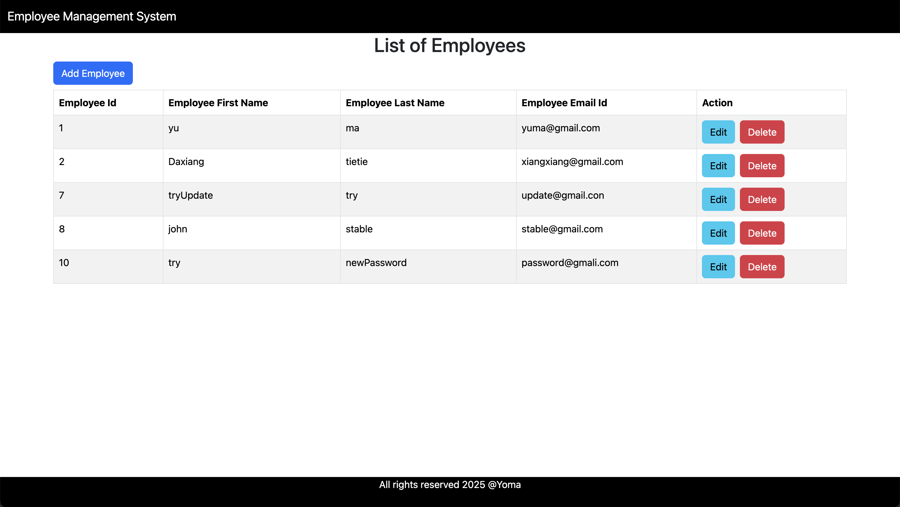

# fullstack-employee-management-system
Full-stack employee management system built with Java, Spring Boot, MySQL, and React. Simulates a modular ERP component with CRUD operations, RESTful APIs, and responsive UI.

## 🌟 Features

- Full CRUD for employee records
- RESTful backend with Spring Boot and JPA
- Responsive frontend with React and Bootstrap
- Clean codebase using MVC architecture
- ESLint integration for code quality
- Axios for API communication

## 🖼️ UI Preview

Below is a snapshot of the Employee Management System in action:

> Note: This UI is intentionally kept simple for focus on full-stack functionality.




## 🚀 Tech Stack

#### Backend
- Java 17
- Spring Boot 3.5.0
- RESTful API
- MySQL
- Maven

#### Frontend
- React 19
- React Router DOM
- Bootstrap 5
- Axios
- Vite
- ESLint

---

## 🛠️ Getting Started

1. Clone the Repository

2. Backend Setup (`ems-backend`)

   - Prerequisites

     - Java 17

     - MySQL

   - Steps

     - Setup MySQL: 

       - Install MySQL `brew install mysql`

       - Start MySQL service `brew services start mysql`

       - Login `mysql -u root`
     
       - Alter password `ALTER USER 'root'@'localhost' IDENTIFIED BY 'yourpassword';`
     
       - Exit MySQL `exit`
     
       - Login using new password `mysql -u root -p`
     
       - Creat new database `CREATE DATABASE ems_db;`
     
     - Configure DB connection in `ems-backend/src/main/resources/application.properties`(creat this file as needed)
     
       ```
       spring.datasource.url=jdbc:mysql://localhost:3306/ems_db
       spring.datasource.username=your_username
       spring.datasource.password=your_password
       
       spring.jpa.properties.hibernate.dialect=org.hibernate.dialect.MySQLDialect
       spring.jpa.hibernate.ddl-auto=update
       spring.jpa.properties.hibernate.format_sql=true
       logging.level.org.hibernate.SQL=DEBUG
       logging.level.org.hibernate.type.descriptor.sql.BasicBinder=TRACE
       ```


   3. Frontend Setup (`ems-frontend-react`)

      - Prerequisites: [Node.js](https://nodejs.org/en)

      - Steps

        ```
  cd ems-frontend-react/ems-frontend
        npm install
        npm run dev
        ```
      
        Visit: http://localhost:5173

3. Run backend and frontend server

   - Open a new terminal window at `/ems-backend`, run `mvn spring-boot:run`

   - Open a new terminal window at `/ems-frontend-react/ems-frontend`, run

     ```
     npm install
     npm run dev
     ```

